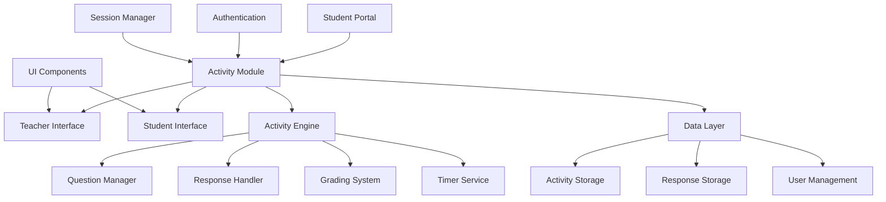

# Design Document

## Overview

The Exam and Activity System is designed as an integrated module within the existing SNHS Student Portal. It provides a comprehensive platform for educational assessment and activity management, featuring separate interfaces for teachers and students while maintaining consistency with the existing portal design system.

The system follows a modular architecture that integrates seamlessly with the current portal infrastructure, utilizing the existing authentication, navigation, and UI components while adding specialized functionality for educational activities and assessments.

## Architecture

### System Architecture



### Component Hierarchy

- **Portal Integration Layer**: Extends existing portal with activity functionality
- **Activity Management Layer**: Core business logic for activities and responses  
- **User Interface Layer**: Separate teacher and student interfaces
- **Data Persistence Layer**: Storage and retrieval of activities and responses
- **Security Layer**: Access control and data validation

## Components and Interfaces

### 1. Activity Manager Component

**Purpose**: Central component managing all activity-related operations

**Key Methods**:
- `createActivity(activityData)`: Creates new activity
- `publishActivity(activityId)`: Makes activity available to students
- `getActivitiesForClass(classId)`: Retrieves activities for specific class
- `submitResponse(activityId, studentId, responses)`: Handles student submissions
- `gradeSubmission(submissionId, grade, feedback)`: Processes teacher grading

**Interfaces**:
```javascript
interface Activity {
    id: string;
    title: string;
    description: string;
    instructions: string;
    dueDate: Date;
    timeLimit?: number; // minutes
    status: 'draft' | 'published' | 'closed';
    questions: Question[];
    assignedClasses: string[];
    createdBy: string;
    createdAt: Date;
}

interface Question {
    id: string;
    type: 'multiple_choice' | 'short_answer' | 'essay' | 'true_false';
    question: string;
    points: number;
    options?: string[]; // for multiple choice
    correctAnswer?: string; // for auto-grading
}
```

### 2. Teacher Interface Component

**Purpose**: Provides teachers with activity creation and management capabilities

**Key Features**:
- Activity creation wizard with step-by-step guidance
- Question builder with multiple question types
- Class assignment and scheduling tools
- Submission review and grading interface
- Analytics and progress tracking

**UI Sections**:
- Activity Dashboard: Overview of all created activities
- Activity Builder: Step-by-step activity creation
- Submissions Manager: Review and grade student work
- Analytics Panel: Class performance insights

### 3. Student Interface Component

**Purpose**: Enables students to access and complete activities

**Key Features**:
- Activity list with status indicators
- Interactive question interface
- Auto-save functionality
- Progress tracking
- Grade and feedback viewing

**UI Sections**:
- My Activities: List of assigned activities
- Activity Viewer: Question interface and submission
- Results Dashboard: Grades and feedback history

### 4. Question Renderer Component

**Purpose**: Dynamically renders different question types with appropriate input controls

**Supported Types**:
- Multiple Choice: Radio buttons with options
- Short Answer: Single-line text input with character limits
- Essay: Rich text editor with formatting tools
- True/False: Binary choice interface

### 5. Timer Service Component

**Purpose**: Manages time-limited activities and automatic submissions

**Key Features**:
- Countdown display with visual indicators
- Automatic submission when time expires
- Time warnings at configurable intervals
- Pause/resume functionality for technical issues

## Data Models

### Activity Data Model

```javascript
{
    id: "act_123456",
    title: "Chapter 5 Quiz - Photosynthesis",
    description: "Assessment covering plant biology concepts",
    instructions: "Answer all questions. You have 30 minutes to complete.",
    dueDate: "2024-11-15T23:59:59Z",
    timeLimit: 30,
    status: "published",
    questions: [
        {
            id: "q1",
            type: "multiple_choice",
            question: "What is the primary function of chlorophyll?",
            points: 5,
            options: [
                "Absorb light energy",
                "Store glucose",
                "Transport water",
                "Produce oxygen"
            ],
            correctAnswer: "Absorb light energy"
        }
    ],
    assignedClasses: ["class_bio_101"],
    createdBy: "teacher_456",
    createdAt: "2024-11-01T10:00:00Z"
}
```

### Student Response Data Model

```javascript
{
    id: "resp_789012",
    activityId: "act_123456",
    studentId: "student_789",
    responses: {
        "q1": "Absorb light energy",
        "q2": "Photosynthesis converts light energy into chemical energy..."
    },
    submissionStatus: "submitted",
    startedAt: "2024-11-10T14:00:00Z",
    submittedAt: "2024-11-10T14:25:30Z",
    timeSpent: 1530, // seconds
    grade: {
        totalPoints: 85,
        maxPoints: 100,
        percentage: 85,
        feedback: "Good work! Review the Calvin cycle for improvement.",
        gradedBy: "teacher_456",
        gradedAt: "2024-11-11T09:15:00Z"
    }
}
```

## Error Handling

### Client-Side Error Handling

1. **Network Connectivity Issues**
   - Auto-save responses locally using localStorage
   - Retry failed requests with exponential backoff
   - Display offline indicators and queue actions

2. **Validation Errors**
   - Real-time form validation with clear error messages
   - Prevent submission of incomplete required fields
   - Guide users to correct input format issues

3. **Session Timeout**
   - Warn users before session expires during activities
   - Auto-save progress before logout
   - Graceful recovery when session is restored

### Server-Side Error Handling

1. **Data Integrity**
   - Validate all inputs against defined schemas
   - Prevent duplicate submissions through idempotency keys
   - Maintain audit trails for all data modifications

2. **Access Control**
   - Verify user permissions for all operations
   - Log unauthorized access attempts
   - Return appropriate HTTP status codes

3. **System Failures**
   - Implement graceful degradation for non-critical features
   - Provide meaningful error messages to users
   - Log detailed error information for debugging

## Testing Strategy

### Unit Testing

**Components to Test**:
- Activity creation and validation logic
- Question rendering for all types
- Response submission and storage
- Grading calculation algorithms
- Timer functionality and auto-submission

**Testing Framework**: Jest with React Testing Library for component testing

### Integration Testing

**Scenarios to Test**:
- Complete activity creation workflow
- Student activity completion flow
- Teacher grading and feedback process
- Cross-browser compatibility
- Mobile responsiveness

### User Acceptance Testing

**Test Cases**:
- Teacher creates and publishes activity successfully
- Student completes timed activity within time limit
- Automatic submission when time expires
- Grade calculation and feedback display
- Accessibility compliance with screen readers

### Performance Testing

**Metrics to Monitor**:
- Page load times for activity lists
- Response time for auto-save operations
- Database query performance for large classes
- Memory usage during long activities
- Network bandwidth for rich content

### Security Testing

**Areas to Validate**:
- Authentication and authorization flows
- Input sanitization and XSS prevention
- SQL injection protection
- Data encryption in transit and at rest
- Session management and timeout handling

## Integration Points

### Portal Navigation Integration

The activity system will be added as a new navigation item in the existing portal structure:

- Desktop navbar: "Activities" tab between "Community Forum" and "Elections & Polls"
- Mobile sidebar: Corresponding mobile navigation item
- Notification integration: Activity due dates and new assignments in notification system

### User Management Integration

Leverages existing portal user management:
- Uses current authentication system
- Integrates with existing user roles (student/teacher)
- Maintains session management consistency
- Follows existing permission patterns

### UI Component Reuse

Utilizes existing portal design system:
- Consistent color scheme and typography
- Reuses button, form, and modal components
- Maintains responsive design patterns
- Follows accessibility standards already established

## Performance Considerations

### Client-Side Optimization

- Lazy loading of activity content
- Debounced auto-save to reduce server requests
- Efficient DOM updates for timer displays
- Caching of frequently accessed data

### Server-Side Optimization

- Database indexing for activity queries
- Pagination for large activity lists
- Compressed response payloads
- CDN integration for static assets

### Scalability Planning

- Horizontal scaling capability for high user loads
- Database partitioning strategies for large datasets
- Caching layers for frequently accessed content
- Load balancing for concurrent users during exams